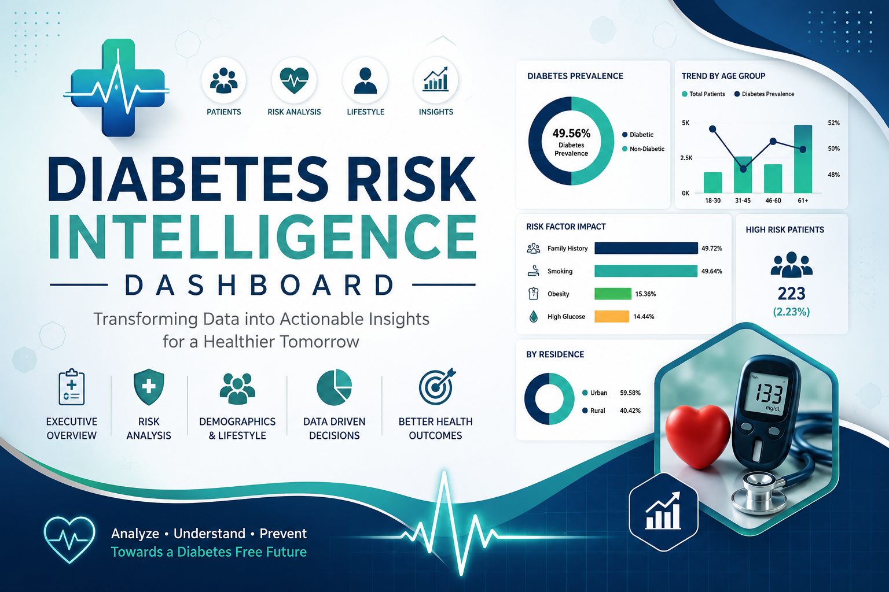
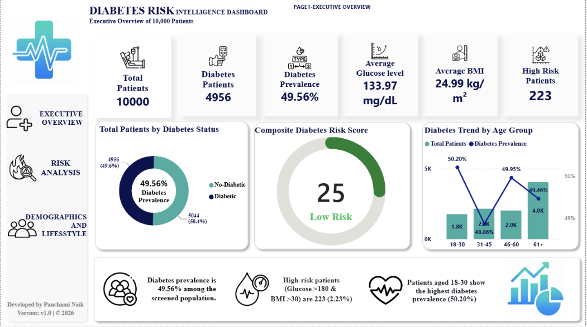
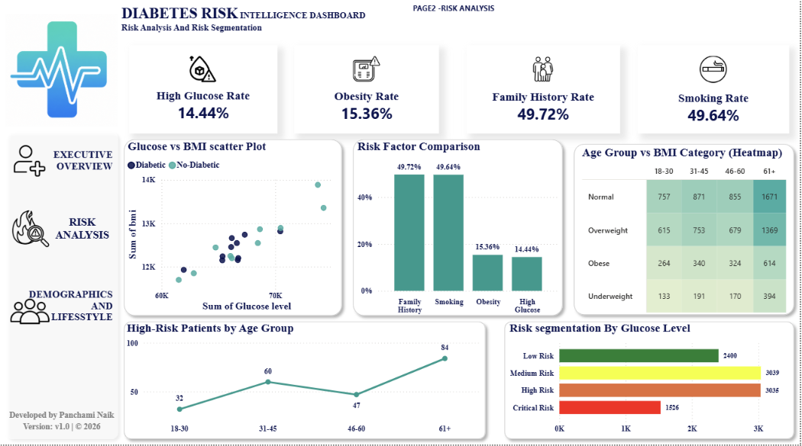
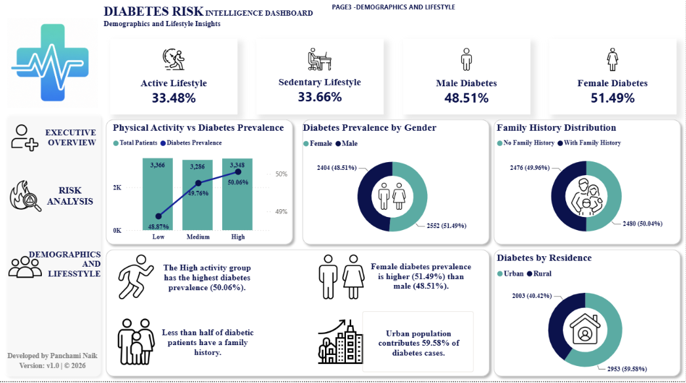

<p align="center">
  
</p>
# 🩺 Diabetes Risk Intelligence Dashboard

> **An end-to-end Business Intelligence project built with Power BI to analyze diabetes risk factors using interactive dashboards, DAX, and Power Query. The dashboard transforms healthcare data into actionable insights through KPI monitoring, demographic analysis, lifestyle trends, and risk assessment.**

---

## 📖 Project Overview

The **Diabetes Risk Intelligence Dashboard** is an interactive healthcare analytics solution designed to help stakeholders understand diabetes prevalence, identify high-risk patients, and analyze the impact of demographic and lifestyle factors on diabetes risk.

This project demonstrates the complete Power BI development lifecycle—from data preparation and modeling to DAX calculations and interactive dashboard design.

---

## 🎯 Project Objectives

- Analyze diabetes prevalence across different patient groups.
- Identify high-risk patients using health indicators.
- Monitor healthcare KPIs through interactive dashboards.
- Compare demographic and lifestyle factors affecting diabetes.
- Support data-driven healthcare decision-making.

---

# 🛠️ Tech Stack

| Category | Tools |
|----------|-------|
| BI Tool | Power BI |
| Data Transformation | Power Query |
| Data Modeling | Star Schema |
| Language | DAX |
| Data Source | CSV |
| Supporting Tools | Microsoft Excel |

---

# 📊 Dashboard Features

### 📌 Executive Dashboard
- Total Patients
- Diabetes Patients
- High Risk Patients
- Diabetes Prevalence %
- Average BMI
- Average Glucose Level

### 📌 Risk Analysis
- High Risk Score
- BMI Distribution
- Glucose Analysis
- Family History Impact
- Smoking Impact
- Obesity Analysis

### 📌 Demographic Analysis
- Gender Comparison
- Age Group Analysis
- Residence Analysis
- Lifestyle Distribution

### 📌 Interactive Features
- Dynamic Filters
- Drill-through Analysis
- KPI Cards
- Interactive Charts
- Custom Theme

---

# 📈 Key Performance Indicators (KPIs)

- 👥 Total Patients
- ⚠️ High Risk Patients
- 💉 Diabetes Patients
- 📊 Diabetes Prevalence %
- ⚖️ Average BMI
- 🩸 Average Glucose Level
- 🚬 Smoking Impact
- 🧬 Family History Impact

---

# 📸 Dashboard Preview

## Executive Dashboard

<p align="center">
  
</p>

---

## Risk Analysis

<p align="center">
  
</p>

---

## Demographic Analysis

<p align="center">
  
</p>

# 📂 Repository Structure

```
diabetes-risk-intelligence-dashboard
│
├── Dashboard
│   └── Diabetes_Risk_Intelligence.pbix
│
├── Dataset
│   └── diabetes.csv
│
├── Documentation
│   ├── Diabetes_PowerBI_Guide.html
│   └── Diabetes_Risk_Intelligence_Project_Documentation.pdf
│   └── PowerBI_Dashboard_Interview_QA.pdf
│
├── Images
│   ├── Banner.png
│   ├── Executive_Dashboard.png
│   ├── Risk_Analysis.png
│   └── Demographic_Analysis.png
│
├── README.md
└── LICENSE
```

---

# 📊 Business Insights

- Identified patients with elevated diabetes risk based on health indicators.
- Analyzed the relationship between BMI, glucose levels, and diabetes prevalence.
- Compared diabetes trends across gender, age groups, and residential areas.
- Evaluated lifestyle factors influencing diabetes risk.
- Built KPI-driven dashboards to support healthcare decision-making.

---

# 💼 Skills Demonstrated

- Data Cleaning
- Data Transformation
- Data Modeling
- DAX Calculations
- Power Query
- KPI Development
- Dashboard Design
- Data Visualization
- Business Intelligence
- Healthcare Analytics
- Storytelling with Data

---

# 🚀 Future Enhancements

- Predictive analytics using Machine Learning
- Real-time data integration
- Patient trend forecasting
- Mobile-optimized dashboard
- Advanced healthcare KPI monitoring

---

# 📁 Dataset

- **Format:** CSV
- **Records:** 5,000+
- **Domain:** Healthcare
- **Purpose:** Educational & Portfolio Project

---

# 👩‍💻 Author

**Panchami Naik**

Aspiring Data Analyst | Power BI Developer

GitHub: https://github.com/panchaminaik

Email: panchaminaik930@gmail.com

---

## ⭐ If you found this project helpful, consider giving it a star!
